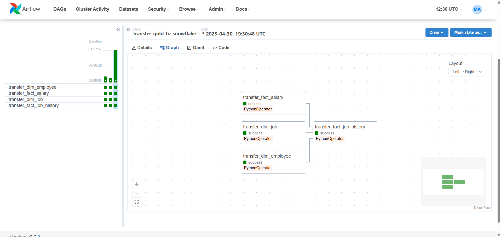

# 🧠 HR Analytics Pipeline with PostgreSQL, Snowflake & Power BI

This project demonstrates an end-to-end HR data analytics pipeline using modern data tools. It covers the **ETL process**, **cloud warehousing**, and **interactive dashboarding** for HR insights.

---

## 📌 Tech Stack

- **PostgreSQL** – Raw HR data storage and transformation
- **Airflow** – Data orchestration (ETL from Bronze → Silver → Gold layers)
- **Snowflake** – Cloud data warehouse for analytical querying
- **Power BI** – Interactive dashboard for business users

---

## 🔄 ETL Workflow (Airflow DAGs)

### `hr_data_etl_dag`
- Cleans raw data from PostgreSQL (`public`) into structured `silver` and `gold` schemas
- Transforms include:
  - Trimming text
  - Type casting
  - Joining reference tables (e.g., department, location)

### `transfer_gold_to_snowflake`
- Moves `gold`-layer tables from PostgreSQL to Snowflake using `PythonOperator` and chunked inserts
- Tables transferred:
  - `dim_employee`
  - `fact_salary`
  - `dim_job`
  - `fact_job_history`
#### ✅ Successful Run Example:

### `hr_analytics_dag`
- Executes analytics queries from Snowflake:
  - Average salary by department
  - Job change trends
  - Top hiring cities

---

## 📊 Power BI Dashboard

### Dashboard Sections:

| Visualization                          | Description                                 |
|----------------------------------------|---------------------------------------------|
| KPI Cards                              | Total salary, unique job roles, managers    |
| Pie Charts                             | Employee share by job title                 |
| Stacked Column Chart                   | Max vs Min salary by job                    |
| Donut Chart                            | Country-wise breakdown of HR footprint      |
| Bar Charts                             | Employees & salary by department            |
| Waterfall Chart                        | Yearly job transitions (promotions)         |

Dashboard connects live to **Snowflake** for reporting.

---

## 🗃️ Database Tables (Gold Layer)

### DIM_EMPLOYEE
- Employee-level info including location, department, and manager

### FACT_SALARY
- Historical salary records for each employee

### DIM_JOB
- Job title with min/max salary ranges

### FACT_JOB_HISTORY
- All previous roles held by employees

---

## 🧹 Data Cleaning Rules

- Removed duplicate `employee_id`, `job_title`, and salary rows
- Deduplicated using `MIN(ctid)` in PostgreSQL
- Preserved only the first valid occurrence of each key group

---

## 🧪 Setup Instructions

### 1. PostgreSQL
- Load raw HR tables in `public` schema
- Run `hr_data_etl_dag` to create `silver` and `gold` schemas

### 2. Airflow
- Add connections:
  - `my_postgres_conn`
  - `my_snowflake_conn`
- Trigger DAGs: `hr_data_etl_dag`, then `transfer_gold_to_snowflake`

### 3. Snowflake
- Run `CREATE TABLE` scripts from `/sql/snowflake_schema.sql`
- Validate data in `HR_PROJECT_DB.HR_ANALYTICS`

### 4. Power BI
- Connect to: `fa17772.me-central2.gcp.snowflakecomputing.com`
- Use warehouse: `COMPUTE_WH`
- Load tables into Power BI model and publish dashboard

